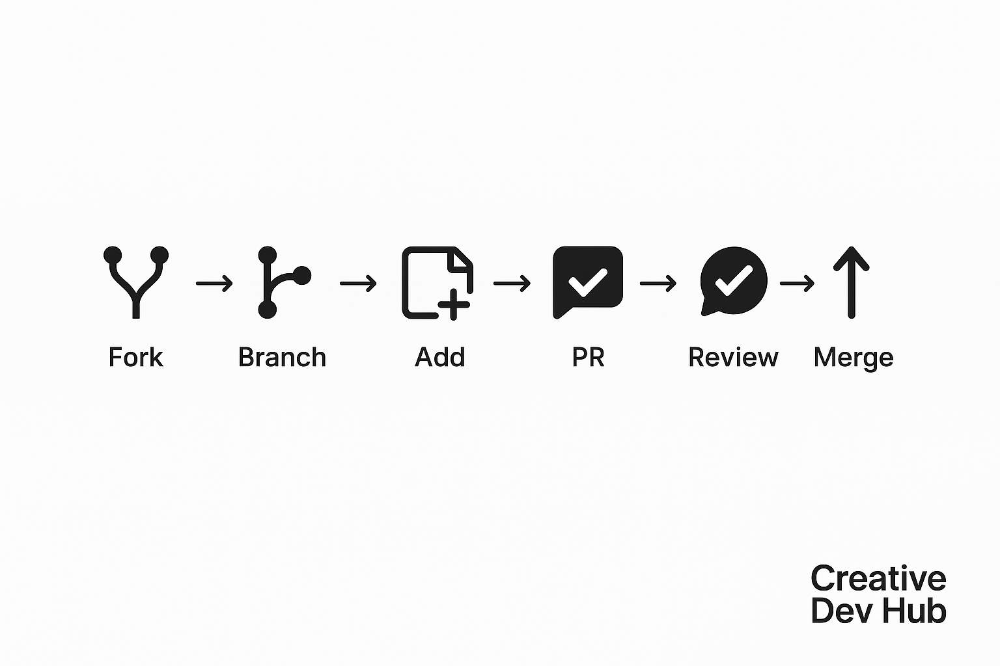

<!--
EN: This document provides contribution guidelines for the Creative Dev Hub community.
TR: Bu belge, Creative Dev Hub topluluğu için katkı yönergelerini içerir.
ES: Este documento proporciona pautas de contribución para la comunidad de Creative Dev Hub.
DE: Dieses Dokument enthält Beitragsrichtlinien für die Creative Dev Hub-Community.
FR: Ce document fournit des lignes directrices pour contribuer à la communauté Creative Dev Hub.
PT: Este documento fornece diretrizes de contribuição para a comunidade Creative Dev Hub.
IT: Questo documento fornisce linee guida per contribuire alla community di Creative Dev Hub.
RU: Этот документ содержит рекомендации по участию в сообществе Creative Dev Hub.
ZH: 本文档提供了 Creative Dev Hub 社区的贡献指南。
JA: このドキュメントは、Creative Dev Hub コミュニティの貢献ガイドラインを提供します。
AR: توضح هذه الوثيقة إرشادات المساهمة في مجتمع Creative Dev Hub.
-->
### 🛠️ Contribution Flow



---

# 🤝 Contributing Guidelines

Thank you for your interest in contributing to **Creative Dev Hub** — a multilingual, community-driven platform where developers collaborate on non-code content that educates, inspires, and connects.

We welcome contributors from all backgrounds and experience levels. Here's how to get started:

---

## 📦 1. Fork the Repository

Click the **Fork** button on the top right of the repository page to create your own copy where you can make changes freely.

---

## 🌍 2. Create Content in the Right Language Folder

Navigate to the appropriate content category (e.g. `blog-posts`, `discussions`, `dev-journals`, etc.) and find the folder for your language (`en`, `tr`, `es`, etc.).

Add your `.md` file in the correct location. Use meaningful filenames using `kebab-case` (e.g. `async-vs-threading.md`).

---

## ✍️ 3. Follow the Content Style Guidelines

- Use clear and respectful language.
- Markdown formatting is preferred. Use headers, lists, and code blocks for clarity.
- Avoid overly technical jargon unless the content is meant for advanced readers.
- Include metadata where appropriate (e.g. `<!-- EN: This content ... -->`).

---

## 🚀 4. Submit a Pull Request

When your content is ready:
1. Commit your changes with a meaningful message (e.g. `feat(blog): add async/await tutorial in Spanish`).
2. Push to your fork.
3. Open a Pull Request (PR) to the `main` branch of this repo.

---

## 🔍 5. Engage in the Review Process

A maintainer or community member will review your PR. You might receive feedback or suggestions. Feel free to:
- Reply with clarifications
- Make changes and push them to your branch
- Ask questions!

All discussions are collaborative and respectful.

---

## ✅ 6. General Contribution Guidelines

- One PR per topic/file is preferred.
- Don't modify others' content without agreement unless fixing typos or formatting.
- Always write in your **native or fluent** language.
- Translations are welcome — just reference the original file in the translated version.
- Respect cultural differences and community values.

---

## 🧠 Example Contribution Flow

```bash
git clone https://github.com/YOUR_USERNAME/creative-dev-hub.git
cd creative-dev-hub
# Add your content under the correct folder and language
git add .
git commit -m "feat(discussion): add REST vs GraphQL overview in German"
git push origin main
